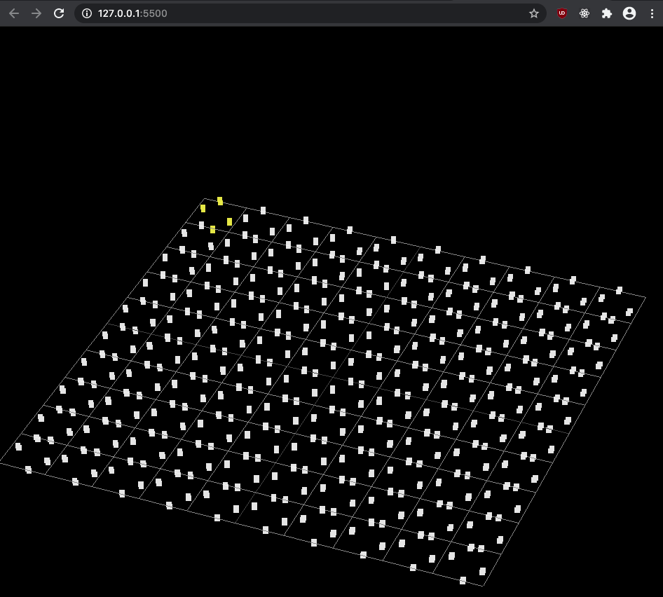
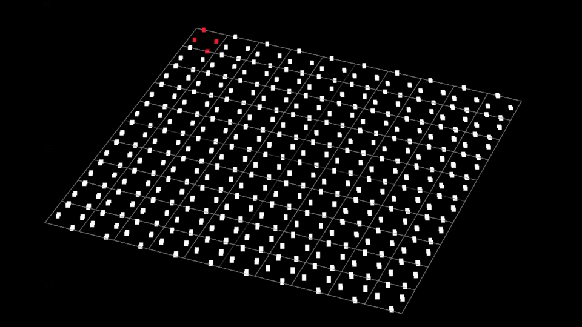
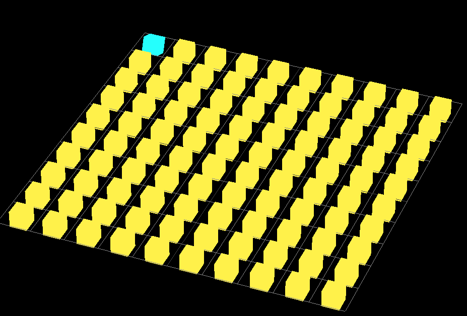
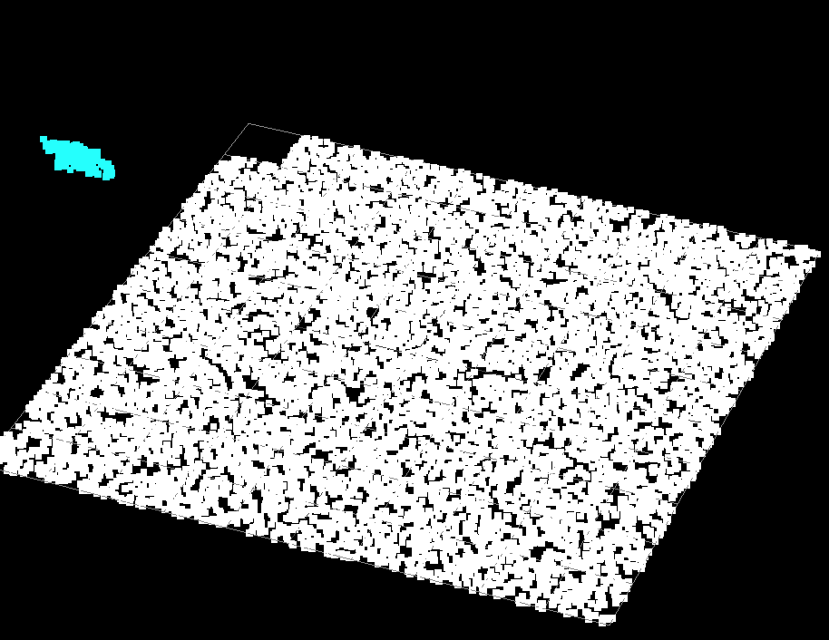

# Three.js (r121) Starter Guide

This repo demonstrates my learning process in preperation for the October 2020 online [AEC Hackathon](https://aechackathon.com/). I experimented with scenes, cameras, renders, geometries, groups, etc. Unfortunately, AutoDesk Forge Viewer v7 restricts users to Three.js r71 (outdated), which means most of my practice wasn't too helpful. 

Outcome from Hackathon (update again later): [COVID-BIM](https://github.com/SimulationEverywhere-Models/COVID-BIM/tree/Visualization_ParticleJS)

## Getting Started 

### Installations
- [VS Code](https://code.visualstudio.com/)
- [Live Server - VS Code Extension](https://marketplace.visualstudio.com/items?itemName=ritwickdey.LiveServer)

### Quickstart

**Task:** Visualize group of Point Cloud Box Geometries 

- Open the repo in VS Code
- At the bottom right corner, select "Go Live"
- You should see the following display:
  

## Development

For the sake of learning how to translate objects onto specific x,y,z positions, a grid helper is in each file. Also, I've chosen BoxGeoemtry for each file for consistency, but you can change to any geometry you like. Also, be aware that BoxGeometry is less performance friendly than BoxBufferGeometry when rendering. You can convert between the two types using .fromGeometry and .fromBufferGeometry ([source](https://stackoverflow.com/questions/49956422/what-is-difference-between-boxbuffergeometry-vs-boxgeometry-in-three-js)). The code in this repo does not explore such actions. 

######/index.js

Material: 
  - THREE.PointsMaterial(params)

Output: 

######/boxesInGrid.js

Material:
  - THREE.MeshBasicMaterial(params)

Output: 

######/particlesInGridScrap.js

Material: 
    - THREE.MeshBasicMaterial(params)
    - THREE.PointsMaterial(params)

Output: 

## Resources

[JavaScript](https://developer.mozilla.org/en-US/docs/Web/javascript)

[Three.js](https://threejs.org/)
